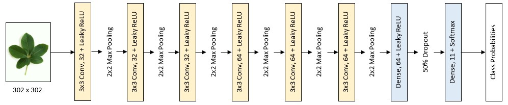

# ConvolutionalNeuralNetworks
Two convolutional neural networks that classify tree leaves by genus

## Table of Contents
* [Introduction](README.md#introduction)
* [Resources Used](README.md#resources-used)
* [Image Processing](README.md#image-processing)
* [Implementations](README.md#implementations)
    * [Model From Scratch](README.md#model-from-scratch)
    * [Transfer Learning Model](README.md#transfer-learning-model)
* [Results](README.md#results)

## Introduction
As part of a group project, I experimented with a type of [deep learning](https://www.sas.com/en_us/insights/analytics/deep-learning.html) algorithm used for image classification known as a [convolutional neural network (CNN)](https://ujjwalkarn.me/2016/08/11/intuitive-explanation-convnets/). I attempted to build and train a CNN that accurately classifies tree leaves by genus. I created two CNNs using two different techniques: a model from scratch and a model based on an existing, pre-trained CNN ([transfer learning](https://machinelearningmastery.com/transfer-learning-for-deep-learning/)). 

## Resources Used
* [Anaconda](https://www.anaconda.com/distribution/) - Python 2.7 distribution used for machine learning
* [Keras](https://keras.io/) - Deep learning library for Python
* [Tensorflow](https://www.tensorflow.org/) - Machine learning library used by Keras
* [PILLOW (Python Imaging Library)](https://pillow.readthedocs.io/en/stable/) - Image processing library used by Keras
* [Leafsnap Dataset](http://leafsnap.com/dataset/) - Collection of 30,000 images of leaves from 185 tree species in the United States
* [Middle European Woods Dataset](http://zoi.utia.cas.cz/node/662) - Collection of 10,000 images of leaves from 153 tree/shrub species in central Europe
* [ResNet50](https://arxiv.org/pdf/1512.03385.pdf) - Neural network included in Keras that has been pre-trained on 1000 classes using 1.2 million images from the [ImageNet](http://image-net.org/index) dataset
* Big Red II - Supercomputer at Indiana University

## Image Processing
Ideally, tree leaves would be classified by species. However, there weren't enough images at the species level in the Leafsnap and Middle European Woods datasets to train a CNN, so the images were instead grouped by tree genus. The 11 genera of which there were the most images were used as classes for the two CNN models.

Of the images of each tree genus selected, 20% were placed in a ```final_test``` folder, 20% of the remaining images were placed in a ```validation``` folder, and the rest were moved to a ```train``` folder. The images of each genus were divided so that images of each species followed the same 20/20/80 distribution. The resulting folder tree was as follows: 
```
data/                              data/                              data/ 
    train/                             validation/                        final_test/
        acer/                              acer/                              acer/
            leaf1.jpg                          leaf1.jpg                          leaf1.jpg    
            leaf2.jpg                          leaf2.jpg                          leaf2.jpg             
            .........                          .........                          .........
        aesculus/                          aesculus/                           aesculus/
        betula/                            betula/                             betula/
        crataegus/                         crataegus/                          crataegus/  
        magnolia/                          magnolia/                           magnolia/ 
        malus/                             malus/                              malus/
        pinus/                             pinus/                              pinus/
        prunus/                            prunus/                             prunus/
        quercus/                           quercus/                            quercus/
        salix/                             salix/                              salix/
        ulmus/                             ulmus/                              ulmus/
```
The images in the ```train``` directory were used to train a model to classify leaves, and the images in the ```validation``` folder were used during each training run/epoch to guage how well the model generalized to images it didn't train on. Once the training of a model was complete, images in the ```final_test``` folder were used to determine how accurately the model classified leaves it hadn't seen before. 

## CNN from Scratch
I followed a [Keras blog post](https://blog.keras.io/building-powerful-image-classification-models-using-very-little-data.html) to create my own CNN and trained it using a GPU on Big Red II. I then tried to optimize my model by modifying model variables one at a time and re-training the model between changes. I ran my final "optimized" model on the 'final_test' leaf images to determine the model's classification accuracy. 


## Implementations
Both CNNs were created using a tutorial in a [Keras blog post](https://blog.keras.io/building-powerful-image-classification-models-using-very-little-data.html) and were trained using GPUs on the Big Red II supercomputer. A [second article](https://www.codesofinterest.com/2017/08/bottleneck-features-multi-class-classification-keras.html) that supplements the Keras blog post was also used to create the CNN based on a pre-trained network.

### Model From Scratch
I first created and trained a basic CNN. I then tried to optimize my model by modifying model variables one at a time and re-training the model between changes to see if the model's validation accuracy (accuracy classifying validation images) at the end of training increased. I manipulated the following parameters:
* Input Image Dimensions - Dimensions Keras resizes images to before giving them to the CNN
* Number of Convolution Layers - Layers that extract features from an image, so it can be classified
* Number of Filters per Convolution - "Feature detectors" used to extract features in a convolution layer
* Filter Dimensions - Size of the filters in the convolution layers
* Filter Stride - Number of pixels that a filter moves by when sliding over an image during a convolution
* Number of Pooling Layers - Layers used to make the CNN invariant to changes to an object's size and location in an image
* [Activation Function](ModelFromScratch/ActivationFunction) - Applied to layers to add non-linearity to the network (allow the CNN to classify non-linear data) 
* Batch Normalization - Used to normalize the output of fully-connected layers (prevent extremely high/low output values) 
* Batch Size - Number of images used to update CNN weights during each step of a training run/epoch
* Optimizer - Technique used for updating CNN weights

From my tests, I concluded that the model figuration shown below is best suited for leaf classification:  
<p align="center">
  
</p>

The final model takes a 302 x 302 pixel image in as input, extracts image features in the convolution layers (yellow), classifies the image using the convolved features in the dense/fully-connected layers (blue), and, for each of the 11 classes, outputs the probability that the leaf in the image belongs to that genus. The first 3 convolution layers in the model use 32 3 x 3 filters that have a horizontal/vertical stride of 1. The last 3 convolution layers use 64 3 x 3 filters with a stride of 1. The feature maps resulting from each convolution layer have Leaky ReLU applied to them and are reduced in size via Max Pooling. The first fully-connected layer has 64 nodes/neurons in it and uses the Leaky ReLU activation function. Dropout is applied to this layer as well to randomly block the output of 50% of the layer's nodes. Finally, the last fully-connected layer has 11 nodes in it (for 11 class probabilities) and uses the Softmax activation function to ensure that all output probabilities are between 0-1 and sum to 1. The model was trained with a batch size of 16 and the Adam optimizer over 50 epochs.


### Transfer Learning Model

## Results

